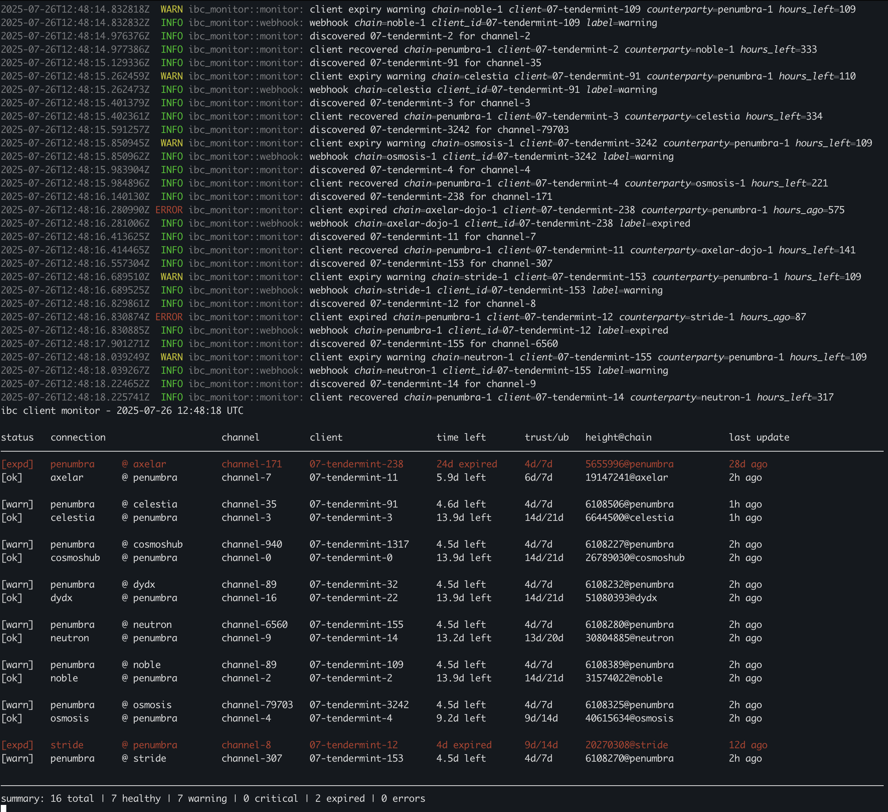
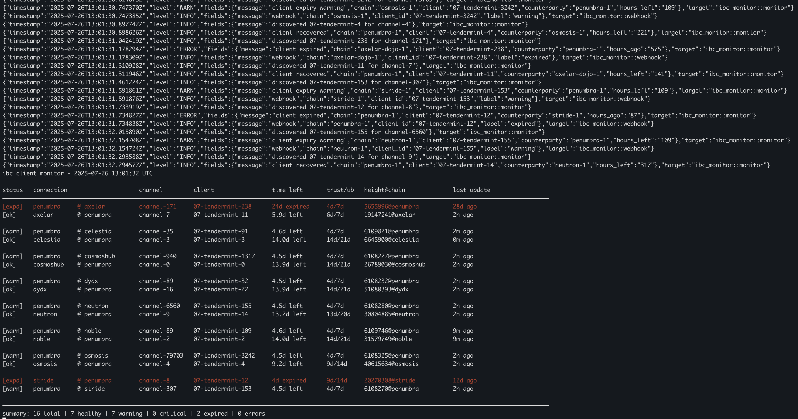

# ibc-monitor

A monitoring tool for IBC light clients.



## Overview

`ibc-monitor` tracks the status of IBC light clients across chains, alerting operators before clients expire.

There are multiple integration points for modern observability stacks: structured logs, Prometheus metrics, and webhook notifications e.g Slack or Discord.

## Quick Start

1. **Install from crates.io**
   ```bash
   cargo install ibc-monitor
   ```

2. **Obtain RPC and gRPC endpoints for each chain**
   
   Public endpoints can be found at:
   - https://cosmos.directory
   - https://polkachu.com/rpc
   - Chain documentation sites
   
   You need:
   - RPC endpoint (typically port 26657)
   - gRPC endpoint (typically port 9090)

3. **Identify the IBC connections to monitor**
   
   Find your channels using:
   - Block explorers (mintscan.io, etc.)
   - `hermes query channels --chain <chain-id>`
   - Chain registry data

   You only need to specify channels, client IDs are auto-discovered, unless you specify them.

4. **Create your configuration**
   ```bash
   cp monitor.example.toml monitor.toml
   ```
   
   Edit `monitor.toml`:
   - Set your RPC/gRPC endpoints
   - Add monitors for each client you want to track
   - Adjust thresholds based on your requirements
   - Add webhook URL if using Slack notifications

5. **Test your configuration**
   ```bash
   ibc-monitor check -c monitor.toml
   ```
   
   This performs a single check and displays results.

6. **Run continuous monitoring**
   ```bash
   ibc-monitor run -c monitor.toml
   ```
   
   Access metrics at http://localhost:9090/metrics

## Installation

```bash
cargo install --path .
```

## Usage

Check all configured clients once:

```bash
ibc-monitor check -c monitor.toml
```

Run continuous monitoring:

```bash
ibc-monitor run -c monitor.toml
```

## Configuration

The monitor reads a TOML configuration file specifying global settings and client endpoints:

```toml
[global]
check_interval = 300       # seconds
warning_threshold = 120    # hours
critical_threshold = 24    # hours
webhook_url = "https://hooks.slack.com/..."  # optional
metrics_enabled = true     # enable prometheus metrics (default: true)
metrics_addr = "0.0.0.0:9090"  # metrics endpoint address (default: 0.0.0.0:9090)

[[monitors]]
name = "Penumbra on Cosmos Hub"
chain_id = "cosmoshub-4"
rpc_addr = "https://cosmos-rpc.example.com/"
grpc_addr = "http://cosmos-grpc.example.com:9090"
client_id = "07-tendermint-1317"  # optional - will auto-discover from channel
channel = "channel-940"
```

Client IDs can be omitted and will be discovered automatically via channel queries.

## Observability

### Metrics

The monitor exposes Prometheus metrics on a configurable endpoint (default: http://localhost:9090/metrics).

To disable metrics collection:

```toml
[global]
metrics_enabled = false
```

To change the metrics endpoint address:

```toml
[global]
metrics_addr = "127.0.0.1:9191"  # custom address and port
```

Available metrics:

```
# HELP ibc_client_hours_until_expiry Hours until IBC client expires
# TYPE ibc_client_hours_until_expiry gauge
ibc_client_hours_until_expiry{chain="penumbra-1",client="07-tendermint-0",counterparty="cosmoshub-4"} 2906.3333333333335
ibc_client_hours_until_expiry{chain="cosmoshub-4",client="07-tendermint-1317",counterparty="penumbra-1"} 2881.3333333333335

# HELP ibc_client_status Current status of IBC client (0=expired, 1=critical, 2=warning, 3=healthy)
# TYPE ibc_client_status gauge
ibc_client_status{chain="penumbra-1",client="07-tendermint-0",counterparty="cosmoshub-4",status="healthy"} 1
ibc_client_status{chain="cosmoshub-4",client="07-tendermint-1317",counterparty="penumbra-1",status="healthy"} 1

# HELP ibc_monitor_check_duration_seconds Duration of monitor check
# TYPE ibc_monitor_check_duration_seconds histogram
ibc_monitor_check_duration_seconds_bucket{le="0.005"} 0
ibc_monitor_check_duration_seconds_bucket{le="0.01"} 0
ibc_monitor_check_duration_seconds_bucket{le="0.025"} 0
ibc_monitor_check_duration_seconds_bucket{le="0.05"} 0
ibc_monitor_check_duration_seconds_bucket{le="0.1"} 0
ibc_monitor_check_duration_seconds_bucket{le="0.25"} 0
ibc_monitor_check_duration_seconds_bucket{le="0.5"} 4
ibc_monitor_check_duration_seconds_bucket{le="1"} 8
ibc_monitor_check_duration_seconds_bucket{le="2.5"} 20
ibc_monitor_check_duration_seconds_bucket{le="5"} 20
ibc_monitor_check_duration_seconds_bucket{le="10"} 20
ibc_monitor_check_duration_seconds_bucket{le="+Inf"} 20
ibc_monitor_check_duration_seconds_sum 23.177515625
ibc_monitor_check_duration_seconds_count 20

# HELP ibc_monitor_checks_total Total number of monitor checks
# TYPE ibc_monitor_checks_total counter
ibc_monitor_checks_total 20
```

### Structured Logging

The monitor emits structured log events for state changes:

- `INFO` - Client recovered to healthy state
- `WARN` - Client approaching expiry
- `ERROR` - Client critical or expired

Enable JSON output for log aggregation:

```bash
LOG_FORMAT=json ibc-monitor run -c monitor.toml
```



### Webhook Notifications

Configure a webhook URL to receive alerts on state changes. The monitor sends formatted messages compatible with Slack incoming webhooks.

## Integration

### Prometheus + Alertmanager

```yaml
scrape_configs:
  - job_name: 'ibc-monitor'
    static_configs:
      - targets: ['localhost:9090']

groups:
  - name: ibc
    rules:
      - alert: IBCClientExpiringSoon
        expr: ibc_client_hours_until_expiry < 24
        annotations:
          summary: "IBC client {{ $labels.client }} expiring in {{ $value }} hours"
```

### Loki + Promtail

```yaml
clients:
  - url: http://loki:3100/loki/api/v1/push

scrape_configs:
  - job_name: ibc-monitor
    static_configs:
      - targets:
          - localhost
        labels:
          job: ibc-monitor
          __path__: /var/log/ibc-monitor.log
```

### Logwatch

Add to `/etc/logwatch/conf/logfiles/ibc-monitor.conf`:

```
LogFile = /var/log/ibc-monitor.log
Archive = /var/log/ibc-monitor.log.*
```

## Architecture

The monitor performs the following operations each check interval:

1. Queries each configured chain's gRPC endpoint
2. Retrieves client and consensus states
3. Calculates time until trusting period expiry
4. Compares against configured thresholds
5. Emits appropriate metrics and log events
6. Sends webhook notifications on state changes

State tracking prevents duplicate alerts when a client remains in the same state across multiple checks.

## Client States

- **Healthy**: More than `warning_threshold` hours until expiry
- **Warning**: Between `warning_threshold` and `critical_threshold` hours remaining
- **Critical**: Less than `critical_threshold` hours remaining
- **Expired**: Trusting period has elapsed

The unbonding period represents the hard deadline after which a client cannot be revived.

## Development

Build from source:

```bash
cargo build --release
```
